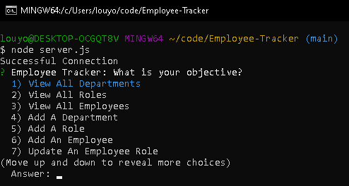
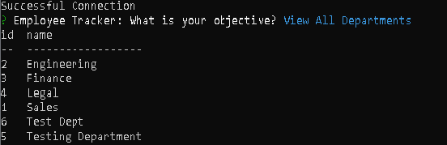
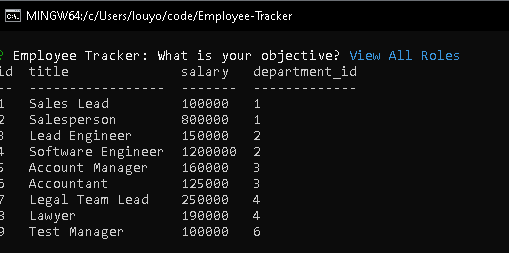
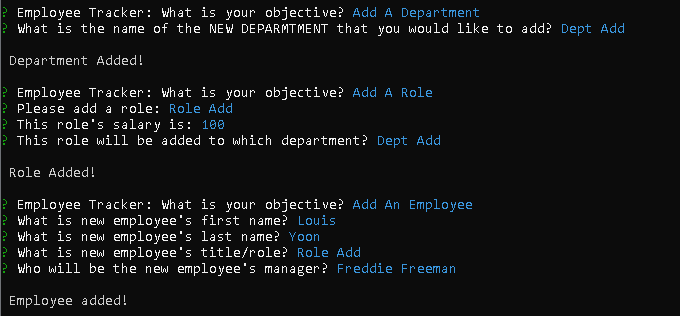
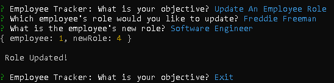

# Employee-Tracker
## SQL

## Description

Create a Content Management System (CMS) by building a command-line application to allow non-developers to easily view and interact with information stored in the database. In this CMS we will manage a company's employee database. using Node.js, Inquirer, and MySQL.

## Table of Content
- [Usage](#Usage)
- [Installation](#Installation)
- [Technology](#Technology)
- [Status](#Status)
- [Links](#Links)
- [Screenshots](#Screenshots)
- [Demo](#Demo)


## Usage

```
AS A business owner
I WANT to be able to view and manage the departments, roles, and employees in my company
SO THAT I can organize and plan my business
```
## Installation

Clone Repository and install dependency packages before starting application running the following command lines:

* Install Dependencies using "npm i"
```
- npm i inquirer@8.2.4
- npm i mysql2
- npm i console.table
```

* Run application using "node."
```
- node server.js
```

## Technology
- Node.js
- MySQL
- Inquirer


## Status

```
GIVEN a command-line application that accepts user input:
```
- WHEN I start the application THEN I am presented with the following options: view all departments, view all roles, view all employees, add a department, add a role, add an employee, and update an employee role
- WHEN I choose to view all departments THEN I am presented with a formatted table showing department names and department ids
- WHEN I choose to view all roles THEN I am presented with the job title, role id, the department that role belongs to, and the salary for that role
- WHEN I choose to view all employees THEN I am presented with a formatted table showing employee data, including employee ids, first names, last names, job titles departments, salaries, and managers that the employees report to
- WHEN I choose to add a department THEN I am prompted to enter the name of the department and that department is added to the database
- WHEN I choose to add a role THEN I am prompted to enter the name, salary, and department for the role and that role is added to the database
- WHEN I choose to add an employee THEN I am prompted to enter the employee’s first name, last name, role, and manager, and that employee is added to the database

```
All Acceptance criteria have been mets
```

## Links

- Github: https://github.com/louyoon89/Employee-Tracker
- Live Demo: [Demo](#Demo) or  https://drive.google.com/file/d/1iwl0cicEvoBzibJDGpUzS5igWyhqKuWV/view?usp=sharing


## Screenshots
* Application Start<br>
<br>
* View All Departments<br>
<br>
* View All Roles<br>
<br>
* View All Employees<br>
<br>
* Add Department, Add Role, Add Employee<br>
<br>
* Update Role & Option to Exit<br>
<br>

## Demo


https://user-images.githubusercontent.com/113860554/209037840-b2bb1105-d35a-4ce0-9893-c1422b5fc07b.mp4


